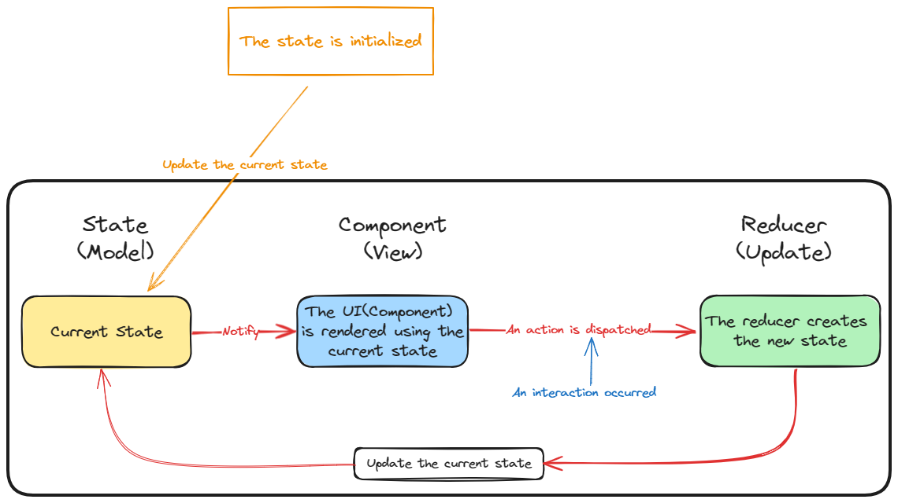

# Avalonia.Redux

Avalonia.Redux is an implementation of [Redux] for the [Avalonia] framework, which allows you to use the Redux pattern to manage your application's state and logic.

## Installation

You can use the NuGet package manager to install Avalonia.Redux, just run the following command in your project:

```bash
dotnet add package Avalonia.Redux
```

Or, you can also add the following dependency in your project file:

```xml
<ItemGroup>
  <PackageReference Include="Avalonia.Redux" Version="0.1.0" />
</ItemGroup>
```

## Design Principles

<p></p>

- **1. Application starts, and state is initialized, and it's current state.**
- **2. Current state changes will trigger the UI to be rendered.**
- **3. When interaction occurs, if user clicks button and an action is sent to Reducer.**
- **4. Reducer creates an instance of updated state.**
- **5. The new state replaces the current state.**
- **6. When the event occurs, return to step 2 of the current list.**

## Usage

To use Avalonia.Redux, you need to define the following parts:

- **State**: This is a class that represents your application's state, containing some properties, such as data, user input, UI state, etc.
- **Action**: This is a class that represents the actions that your application can perform, such as adding, deleting, updating, etc. Each action has a type, used to distinguish different actions, and some optional parameters, used to pass some extra information.
- **Reducer**: This is a function that takes the current state and an action, and returns a new state. Depending on the action type, you can modify the state, or return the original state if no modification is needed.
- **Store**: This is a class that creates and manages your application's state, and dispatches and handles actions. You can create an instance of Store at the entrance of your application, passing in your defined initial state and reducer function. You can also register some listeners to the Store, to update your UI or perform some other operations when the state changes.
- **Component**: This is a class that inherits from Avalonia's control classes, such as Window, UserControl, etc. You can use the Store's methods in your component to dispatch actions, or use the Store's properties to get the current state. You can also use some extension methods, such as Connect, Dispatch, etc., to simplify your code.

## Example

You can find a simple example in this repository, showing how to use Avalonia.Redux to implement a Todo List application. You can run the following commands to clone this repository and run the example:

```bash
git clone https://github.com/GavinHome/Avalonia.Redux.git
cd Avalonia.Redux
dotnet run --project samples\samples.Desktop
```

You can also check the source code in the [Example] folder to understand the implementation details of the example.
