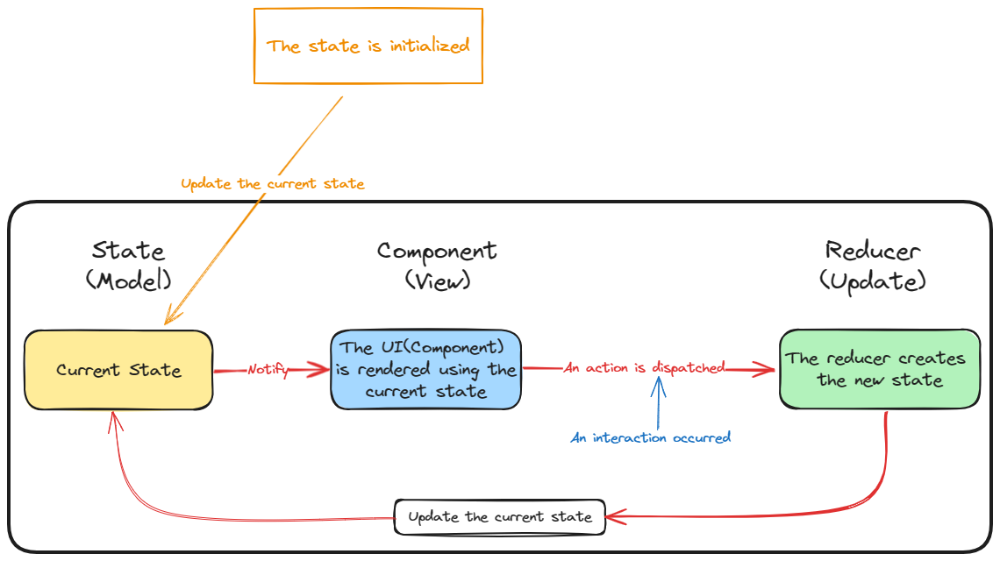
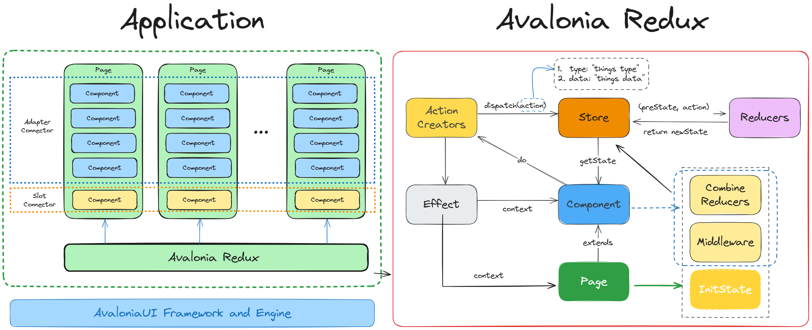
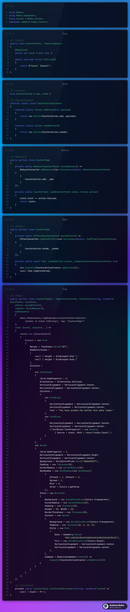
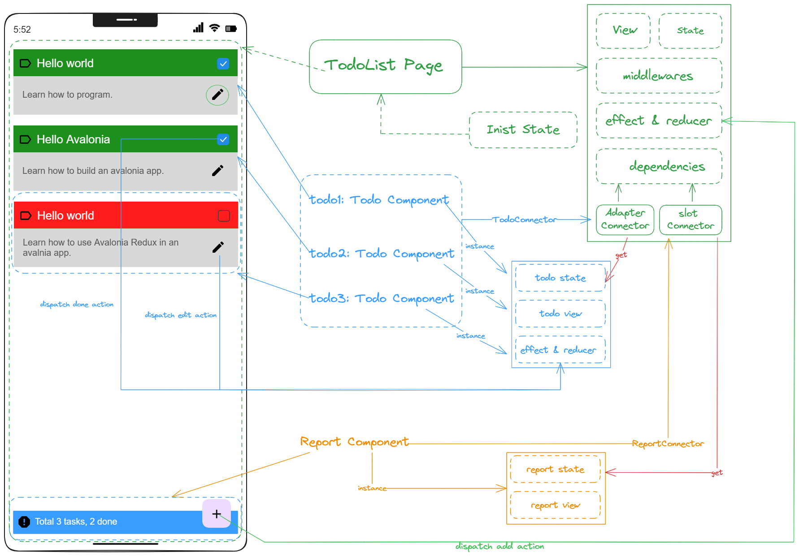

# Avalonia.Redux

Avalonia Redux is an assembled cross-platform application framework based on Redux state management for MVU pattern,  using C# and AvaloniaUI. It allows you to manage your application state and logic based on Redux implemention of MVU. MVU is an implementation idea based on one-way data flow, as shown in the figure below:

<p></p>

- **1. When the application start, and state is initialized to the current state.**
- **2. When the state changes, and UI rendering to be rendered will be triggered.**
- **3. When interaction occurs, such as the user clicks on the event, an action is sent to the Reducer.**
- **4. Executing the Update action will create an instance of the updated state.**
- **5. The new state replaces the current state, and returns to step [2].**


## Installation(Coming soon)

You can use the NuGet package manager to install Avalonia.Redux, just run the following command in your project:

```bash
dotnet add package Avalonia.Redux
```

Or, you can also add the following dependency in your project file:

```xml
<ItemGroup>
  <PackageReference Include="Avalonia.Redux" Version="0.1.0" />
</ItemGroup>
```

## Design Principles

<p></p>

The Avalonia Redux framework mainly contains the following parts:

- **Action Creators**: Create executable actions that represent pages or components. Each action has a type to distinguish different actions, and some optional parameters to pass some additional information.
- **Store**: Create and manage application state, dispatch and process actions. When each Page is initialized, a Store instance is created, the initial state and Reducer function are passed in, and some listeners can also be registered with the Store to update the UI or perform some other operations when the state changes.
- **Reducers**: This is a pure function that receives the current state and an action and returns a new state.
- **Effect**: Extensions that handle application side effects, such as jump routing, request data, etc.
- **Component**: Represents a stateless component, which is combined into a part of the Page through Adapter Connector or Slot Connector.
- **Page**: Represents a stateful page component, inherited from Component, which contains the following three parts.
   - InitState: initialization state function, unique to Page component
   - Middleware: middleware, such as printing logs in listening functions, etc.
   - CombineReducers: Integrate all Reducers of page components and sub-components together


## Usage

To use Avalonia.Redux, you need to define the following parts:

- **State**: This is a class that represents data and contains some properties, etc.
- **Action**: This is a class or enumeration that represents the actions that the application can perform, such as add, delete, update, etc. Each action has a type to distinguish different actions, and some optional parameters to pass some additional information.
- **Component**: (Optional) This is a class that represents a stateless view component. Use the method (Dispatch) in Store to dispatch actions, or use the properties of Store to obtain the current state.
- **Page**: This is a class that represents a stateful page component, including the following 6 parts, of which initState, Reducer, and View must be set.
   - **InitState**: initialization state function
   - **Reducer**: This is a pure function. According to the action type, the corresponding function is executed to modify the state.
   - **View**: The UI part of the component, which can be built using XAML or C#
   - **Effect**: (optional) An extension to Reducer, which mainly handles side effects and executes corresponding functions according to the action type.
   - **Middleware**: (optional) middleware, such as listening functions for printing logs, etc.
   - **Dependencies**: (Optional) If a complex page is composed of multiple sub-components, you can set Adapter Connector and Slot Connector. The former is suitable for dynamic collection components, and the latter is suitable for single components.


There are five steps to use the counter as an example:

> 1. Import avalonia redux package
> 2. Create State
> 3. Define Action and ActionCreator
> 4. Create Reducer that modifies state
> 5. Create Page or Component

<p></p>

<!--
```cs
using Redux;
using Redux.Component;
using Action = Redux.Action;
namespace samples.Pages.Counter;

/// [State]
public class CounterState : ReactiveObject
{
    [Reactive]
    public int Count { get; set; }

    public override string ToString()
    {
        return $"Count: {Count}";
    }
}

/// [Action]
enum CounterAction { add, onAdd }

/// [ActionCreator]
internal static class CounterActionCreator
{
    internal static Action addAction(int payload)
    {
        return new Action(CounterAction.add, payload);
    }

    internal static Action onAddAction()
    {
        return new Action(CounterAction.onAdd);
    }
}

/// [Reducer]
public partial class CounterPage
{
    private static Reducer<CounterState> buildReducer() => ReducerConverter.AsReducers(new Dictionary<object, Reducer<CounterState>>
    {
        {
            CounterAction.add, _add
        }
    });

    private static CounterState _add(CounterState state, Action action)
    {
        state.Count += action.Payload;
        return state;
    }
}

/// [Effect]
public partial class CounterPage
{
    private static Effect<CounterState>? buildEffect() => 
        EffectConverter.CombineEffects(new Dictionary<object, SubEffect<CounterState>>
    {
        {
            CounterAction.onAdd, _onAdd
        }
    });

    private static async Task _onAdd(Action action, ComponentContext<CounterState> ctx)
    {
        ctx.Dispatch(CounterActionCreator.addAction(1));
        await Task.CompletedTask;
    }
}

/// [Page]
public partial class CounterPage() : Page<CounterState, Dictionary<string, dynamic>>(initState: initState,
    effect: buildEffect(),
    reducer: buildReducer(),
    middlewares:
    [
        Redux.Middlewares.logMiddleware<CounterState>(monitor: 
            (state) => state.ToString(), tag: "CounterPage")
    ],
    view: (state, dispatch, _) =>
    {
        return new ContentControl
        {
            Content = new Grid
            {
                Margin = Thickness.Parse("10"),
                RowDefinitions =
                [
                    new() { Height = GridLength.Star },
                    new() { Height = GridLength.Auto }
                ],
                Children =
                {
                    new StackPanel
                    {
                        [Grid.RowProperty] = 0,
                        Orientation = Orientation.Vertical,
                        VerticalAlignment = VerticalAlignment.Center,
                        HorizontalAlignment = HorizontalAlignment.Center,
                        Children =
                        {
                            new TextBlock
                            {
                                HorizontalAlignment = HorizontalAlignment.Center,
                                VerticalAlignment = VerticalAlignment.Center,
                                Text = "You have pushed the button this many times:"
                            },
                            new TextBlock
                            {
                                HorizontalAlignment = HorizontalAlignment.Center,
                                VerticalAlignment = VerticalAlignment.Center,
                                [!TextBlock.TextProperty] = new Binding
                                    { Source = state, Path = nameof(state.Count) }
                            }
                        }
                    },
                    new Border
                    {
                        [Grid.RowProperty] = 1,
                        HorizontalAlignment = HorizontalAlignment.Right,
                        VerticalAlignment = VerticalAlignment.Center,
                        Background = SolidColorBrush.Parse("#bbe9d3ff"),
                        Padding = new Thickness(0),
                        CornerRadius = new CornerRadius(15),
                        BoxShadow = new BoxShadows(new BoxShadow()
                            { 
                                OffsetX = 1, OffsetY = 5, 
                                Spread = 1, 
                                Blur = 8, 
                                Color = Colors.LightGray 
                            }),
                        Child = new Button()
                        {
                            Background = new SolidColorBrush(Colors.Transparent),
                            CornerRadius = new CornerRadius(15),
                            Padding = new Thickness(0),
                            Height = 50, Width = 50,
                            BorderThickness = new Thickness(0),
                            Content = new Border
                            {
                                Background = new SolidColorBrush(Colors.Transparent),
                                Padding = new Thickness(8, 5, 12, 8),
                                Child = new Path
                                {
                                    Data = Geometry.Parse(
                                            "M19,13H13V19H11V13H5V11H11V5H13V11H19V13Z"),
                                    Fill = new SolidColorBrush(Colors.Black),
                                    HorizontalAlignment = HorizontalAlignment.Center,
                                    VerticalAlignment = VerticalAlignment.Center,
                                },
                            },
                            Command = ReactiveCommand.Create(() =>
                                dispatch(CounterActionCreator.onAddAction()))
                        }
                    }
                }
            }
        };
    })
{
    /// [InitState]
    private static CounterState initState(Dictionary<string, dynamic>? param) => 
        new() { Count = 99 };
}
```
-->
## Example

You can find a simple example in this repository, showing how to use Avalonia.Redux to implement a Todo List application. You can run the following commands to clone this repository and run the example:

```bash
git clone https://github.com/GavinHome/Avalonia.Redux.git
cd Avalonia.Redux
dotnet run --project samples\samples.Desktop
```

This example is to divide a large Page into different sub-components (Components), and finally assemble it into a complete application in the Page, as shown below:

<p></p>

You can also check the source code in the [Example] folder to understand the implementation details of the example.
