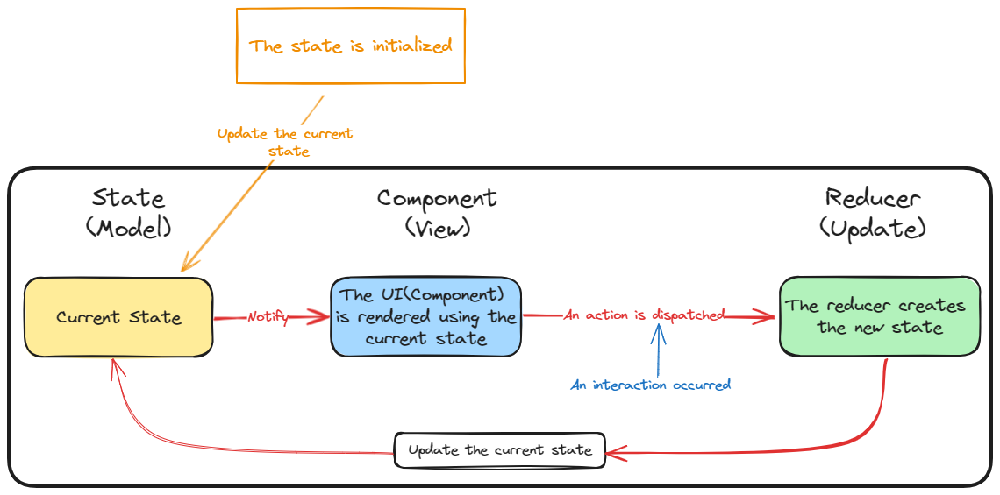

# Avalonia.Redux

Avalonia Redux is an assembled cross-platform application framework based on Redux state management for MVU pattern,  using C# and AvaloniaUI. It allows you to manage your application state and logic based on Redux implemention of MVU.

MVU is an implementation idea based on one-way data flow, as shown in the figure below£º

<p></p>

- **1. Application starts, and state is initialized, and it's current state.**
- **2. Current state changes will trigger the UI to be rendered.**
- **3. When interaction occurs, if user clicks button and an action is sent to Reducer.**
- **4. Reducer creates an instance of updated state.**
- **5. The new state replaces the current state.**
- **6. When the event occurs, return to step 2 of the current list.**


## Installation

You can use the NuGet package manager to install Avalonia.Redux, just run the following command in your project:

```bash
dotnet add package Avalonia.Redux
```

Or, you can also add the following dependency in your project file:

```xml
<ItemGroup>
  <PackageReference Include="Avalonia.Redux" Version="0.1.0" />
</ItemGroup>
```

## Design Principles

<p></p>

The Avalonia Redux framework mainly contains the following parts:

- **Action Creators**: Create executable actions that represent pages or components. Each action has a type to distinguish different actions, and some optional parameters to pass some additional information.
- **Store**: Create and manage application state, dispatch and process actions. When each Page is initialized, a Store instance is created, the initial state and Reducer function are passed in, and some listeners can also be registered with the Store to update the UI or perform some other operations when the state changes.
- **Reducers**: This is a pure function that receives the current state and an action and returns a new state.
- **Effect**: Extensions that handle application side effects, such as jump routing or requesting data.
- **Component**: Represents a stateless view component, which can be combined into a part of the Page through the Adapter Connector or Slot Connector.
- **Page**: Represents a stateful page component, inherited from Component, which contains the following three parts.
   - InitState: initialization state
   - Middleware: middleware, such as printing logs in listening functions, etc.
   - CombineReducers: Integrate all Reducers of page components and sub-components together


## Usage

To use Avalonia.Redux, you need to define the following parts:

- **State**: This is a class that represents data and contains some properties, etc.
- **Action**: This is a class that represents actions that the application can perform, such as adding, deleting, updating, etc. Each action has a type to distinguish different actions, and some optional parameters to pass some additional information.
- **Component**: (optional) This is a class that represents a view component, which is generally a stateless component. You can use the method (Dispatch) in the Store to distribute actions, or use the properties of the Store to obtain the current state. .
- **Page**: This is a class that represents a page component. It is a necessary stateful component. It inherits from Component. You can use the method (Dispatch) in the Store to distribute actions, or use the properties of the Store to get the current status.
   - **InitState**: Initialization state function, Page component must be set
   - **Effect**: (optional) This is a class used to create and manage your application's state, as well as dispatch and handle actions. You can create a Store instance at the entry point of your application, passing in the initial state and Reducer function you defined. You can also register some listeners with the Store to update your UI or perform other operations when the state changes.
   - **Reducer**: This is a function that receives the current state and an action and returns a new state. Depending on the type of action, you can make some modifications to the state, or simply return to the original state if no modifications are needed.
   - **Middleware**: (optional) middleware, such as printing logs in listening functions, etc.
   - **Dependencies**: (Optional) If a complex page is composed of multiple sub-components, you can set Adapter Connector and Slot Connector. The former is suitable for dynamic collection components, and the latter is suitable for single components.
   - **View**: The UI part of the component, which can be built using XAML or C#

## Example

You can find a simple example in this repository, showing how to use Avalonia.Redux to implement a Todo List application. You can run the following commands to clone this repository and run the example:

```bash
git clone https://github.com/GavinHome/Avalonia.Redux.git
cd Avalonia.Redux
dotnet run --project samples\samples.Desktop
```

You can also check the source code in the [Example] folder to understand the implementation details of the example.
