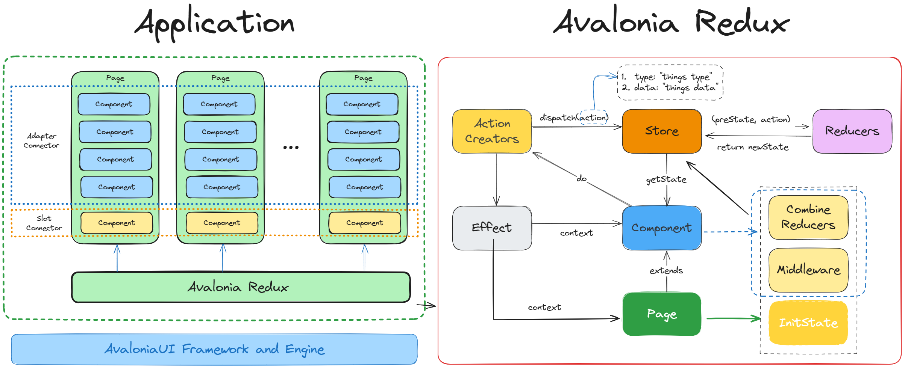

# Avalonia.Redux

Avalonia Redux 是一个基于 MVU 模式的 Redux 状态管理的组装式跨平台应用程序框架，使用 C# 和 AvaloniaUI 实现。 它允许您使用基于 Redux 的状态管理框架来管理应用程序状态和逻辑。MVU是单向数据流，如下图所示：

<p></p>

- **1.当应用启动时，状态被初始化为当前状态。**
- **2.当状态更改时，将触发要呈现的 UI 渲染。**
- **3.当发生交互时，如用户点击事件，则向Reducer发送动作。**
- **4.执行Update动作，将创建更新状态的实例。**
- **5.新状态取代当前状态，返回当前列表的步骤[2]。**


## 安装

你可以使用 NuGet 包管理器来安装 Avalonia.Redux，只需在你的项目中运行以下命令：

```bash
dotnet add package Avalonia.Redux
```

或者，你也可以在你的项目文件中添加以下依赖：

```xml
<ItemGroup>
  <PackageReference Include="Avalonia.Redux" Version="0.1.0" />
</ItemGroup>
```

## 框架设计


<p></p>


Avalonia Redux框架主要包含以下几个部分：

- **Action Creators**：创建表示页面或组件的可执行动作，每个动作都有一个类型，用来区分不同的动作，以及一些可选的参数，用来传递一些额外的信息。
- **Store**：创建和管理应用程序状态，分发和处理动作。每个Page初始化时，会创建一个 Store 的实例，传入初始状态和 Reducer 函数，以及也可以向 Store 注册一些监听器，用来在状态发生变化时更新 UI 或者执行一些其他的操作。
- **Reducers**：这是一个纯函数，接收当前的状态和一个动作，返回一个新的状态。
- **Effect**：处理应用程序副作用的扩展，比如跳转路由、请求数据等。
- **Component**：表示无状态组件，通过Adapter Connector 或者 Slot Connector组合成Page的一部分。
- **Page**：表示有状态的页面组件，继承自Component，它包含以下三个部分。
  - InitState: 初始化状态函数，Page组件独有
  - Middleware:  中间件，例如监听函数中打印日志等
  - CombineReducers:  将页面组件和子组件的所有Reducers集成到一起


## 使用方法

要使用 Avalonia.Redux，你需要定义以下几个部分：

- **State**：这是一个类，表示数据，包含一些属性等。
- **Action**：这是一个类或枚举，表示应用程序可以执行的动作，比如增加、删除、更新等。每个动作都有一个类型，用来区分不同的动作，以及一些可选的参数，用来传递一些额外的信息。
- **Component**：（可选）这是一个类，表示无状态的视图组件，使用 Store 中的方法（Dispatch）来分发动作，或者使用 Store 的属性来获取当前的状态。
- **Page**：这是一个类，表示有状态的页面组件，包含以下6个部分，其中initState、Reducer、View必须设置。
  - **InitState**: 初始化状态函数
  - **Reducer**：这是一个纯函数，根据动作类型，执行对应函数实现对状态的修改。
  - **View**: 组件的UI部分，可使用XAML或C#来构建
  - **Effect**：（可选）对Reducer的扩展，主要处理副作用，根据动作类型执行相应的函数。
  - **Middleware**:（可选）中间件，例如打印日志的监听函数等
  - **Dependencies**:（可选）若由多个子组件共同组成复杂的页面Page, 可设置Adapter Connector和Slot Connector，前者适用于动态集合组件，后者适用于单个组件


## 示例

你可以在这个仓库中找到一个简单的示例，展示了如何使用 Avalonia.Redux 来实现一个 Todo List 的应用程序。你可以运行以下命令来克隆这个仓库，并运行示例：

```bash
git clone https://github.com/GavinHome/Avalonia.Redux.git
cd Avalonia.Redux
dotnet run --project samples\samples.Desktop
```

你也可以查看 [Example] 文件夹中的源代码，了解示例的具体实现细节。

